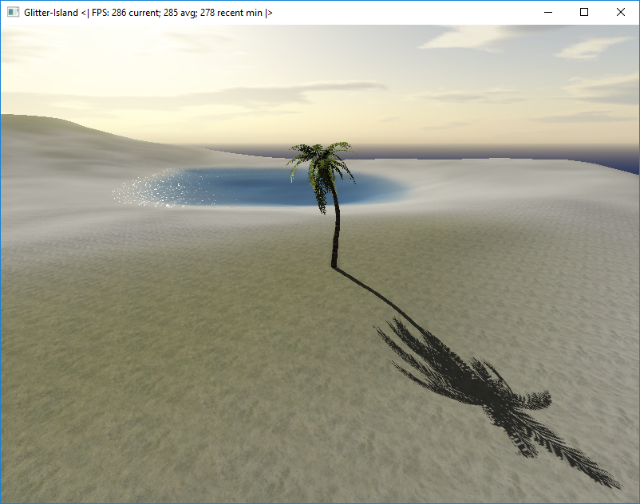

Glitter-Island
==============

Glitter-Island is a personal project that is made for learning and practicing
real-time computer graphics and programming in general. It uses OpenGL for rendering 
and it supports all three main PC platforms (Linux, Windows, MAC). In the process of 
creating Glitter-Island the primary goal is to make it look amazing, while 
keeping real-time performance on medium range computers. However this goal 
sometimes gets put aside to invest in code quality, portability, and 
occasionally for other regards.

## How to

This section contains some useful information for those who wants to 
try out this little program.

### Build

CMake project files are provided. Project files for a desired environment 
can be generated using [CMake](https://cmake.org/).

**OpenGL 3.3 is required to build and run this application.**

There are no dependencies needed to be installed for _Visual Studio 2015_, project is 
ready to be used out-of-the-box for its compiler.

In case of an _other compiler_ the following dependencies' dev packages are required to be installed:
[SFML 2.1](http://www.sfml-dev.org/download/sfml/2.1/) (or higher) and [GLEW](http://glew.sourceforge.net/).

A particular instance of [glm](http://glm.g-truc.net), and [oglplus](http://oglplus.org/) is provided, but 
they can be optionally used or discarded by setting the corresponding cmake variables to the desired value. 
If any of the provided libraries is not used then it is required to be installed. 
(Note: oglplus is configured for VS 2015, and should work on Linux too.)

### Use

**OpenGL 3.3 is required to run this application.** If the program does not start, 
it is recommended to update your display driver.

Once the program is running the user can observe the island. 
For movement, use [WASD keys](https://en.wikipedia.org/wiki/Arrow_keys#WASD_keys). 
Hold down SHIFT to fly faster. Press Z to capture the mouse so that mouse movement 
controlls view direction. Press Z again to release the mouse. An other option is to hold down 
the right mouse button while moving the mouse.

Table of available controlls:

| Key / Input | Effect                                | Mode                    |
|-------------|---------------------------------------|-------------------------|
| W           | Move forward                          | All                     |
| S           | Move backward                         | All                     |
| A           | Move left                             | All                     |
| D           | Move right                            | All                     |
| SHIFT       | Move faster                           | All                     |
| CTRL        | Move ultra fast                       | All                     |
| Z           | Capture/Release mouse                 | All                     |
| Right click | Capture mouse                         | All                     |
| E           | Toggle "Editor mode"                  | All                     |
| H           | Toggle wireframe display              | All                     |
| Up Arrow    | Change sun elevation                  | All                     |
| Down Arrow  | Change sun elevation                  | All                     |
| 0-9         | Tool selection                        | Editor                  |
| R           | Move selection up                     | Editor, Model selection |
| F           | Move selection down                   | Editor, Model selection |
| SPACE       | Choose selected                       | Editor, Model selection |
| Left click  | Apply selection                       | Editor, Model selection |
| Scroll down | Increase brush radius                 | Editor                  |
| Scroll up   | Decrease brush radius                 | Editor                  |
| +           | Inc brush radius by a greater amount  | Editor                  |
| -           | Dec brush radius by a greater amount  | Editor                  |
| M           | Save all changes                      | Editor                  |
